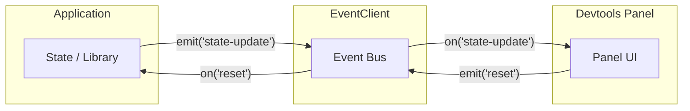
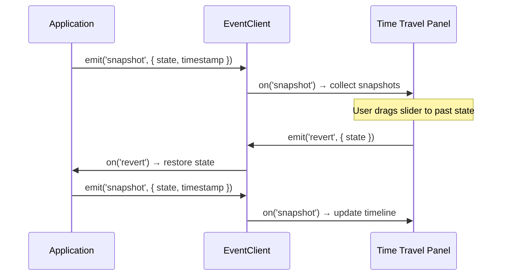

Most devtools plugins observe state in one direction: app to devtools. But `EventClient` supports two-way communication. Your devtools panel can also send commands back to the app. This enables features like state editing, action replay, and time-travel debugging.



## Pattern: App to Devtools (Observation)

The standard one-way pattern. Your app emits events, the devtools panel listens.

```ts
// In your app/library
eventClient.emit('state-update', { count: 42 })

// In your devtools panel
eventClient.on('state-update', (e) => {
  setState(e.payload)
})
```

## Pattern: Devtools to App (Commands)

The panel emits command events, the app listens and reacts.

```ts
// In your devtools panel (e.g., a "Reset" button click handler)
eventClient.emit('reset', undefined)

// In your app/library
eventClient.on('reset', () => {
  store.reset()
})
```

You need to define both directions in your event map:

```ts
type MyEvents = {
  // App → Devtools
  'state-update': { count: number }
  // Devtools → App
  'reset': void
  'set-state': { count: number }
}
```

## Pattern: Time Travel

The most powerful bidirectional pattern. Combine observation with command-based state restoration.



### Event Map

```ts
type TimeTravelEvents = {
  'snapshot': { state: unknown; timestamp: number; label: string }
  'revert': { state: unknown }
}
```

### App Side

Emit snapshots on every state change:

```ts
function applyAction(action) {
  state = reducer(state, action)

  timeTravelClient.emit('snapshot', {
    state: structuredClone(state),
    timestamp: Date.now(),
    label: action.type,
  })
}

// Listen for revert commands from devtools
timeTravelClient.on('revert', (e) => {
  state = e.payload.state
  rerender()
})
```

### Panel Side

Collect snapshots and provide a slider:

```tsx
function TimeTravelPanel() {
  const [snapshots, setSnapshots] = useState([])
  const [index, setIndex] = useState(0)

  useEffect(() => {
    return timeTravelClient.on('snapshot', (e) => {
      setSnapshots((prev) => [...prev, e.payload])
      setIndex((prev) => prev + 1)
    })
  }, [])

  const handleSliderChange = (newIndex) => {
    setIndex(newIndex)
    timeTravelClient.emit('revert', { state: snapshots[newIndex].state })
  }

  return (
    <div>
      <input
        type="range"
        min={0}
        max={snapshots.length - 1}
        value={index}
        onChange={(e) => handleSliderChange(Number(e.target.value))}
      />
      <p>
        State at: {snapshots[index]?.label} (
        {new Date(snapshots[index]?.timestamp).toLocaleTimeString()})
      </p>
      <pre>{JSON.stringify(snapshots[index]?.state, null, 2)}</pre>
    </div>
  )
}
```

## Best Practices

- **Keep payloads serializable.** No functions, DOM nodes, or circular references.
- **Use `structuredClone()` for snapshots** to avoid reference mutations.
- **Debounce frequent emissions** if needed (e.g., rapid state changes).
- **Use distinct event suffixes** for observation vs commands (e.g., `state-update` for observation, `set-state` for commands).
