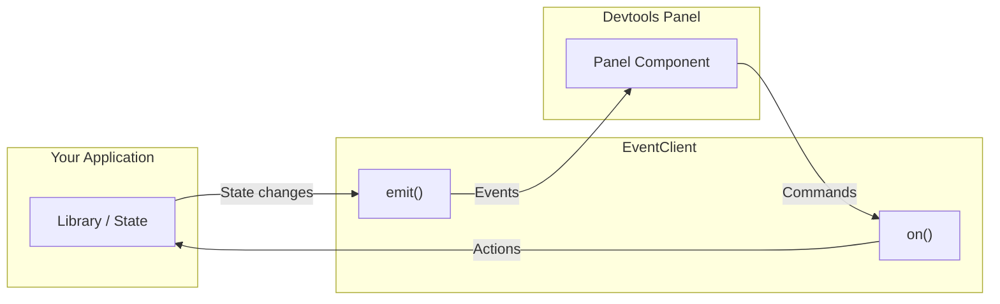

You can build custom devtools plugins for any state management library, API client, or internal tool. A plugin consists of two parts:

1. **An EventClient** — sends and receives data between your application code and the devtools panel.
2. **A panel component** — displays the data inside the devtools UI.



The EventClient is framework-agnostic. It works the same in React, Vue, Solid, Preact, or vanilla JavaScript. The panel component can be written in any framework supported by an adapter.

This guide walks through building a custom plugin from scratch using a "store inspector" as a running example.

## Step 1: Define Your Event Map

Start by creating a TypeScript type that maps event names to their payload types:

```ts
type StoreEvents = {
  'state-changed': { storeName: string; state: unknown; timestamp: number }
  'action-dispatched': { storeName: string; action: string; payload: unknown }
  'reset': void
}
```

Each key in the event map is just the event name (the suffix). Do **not** include the `pluginId` in the key — the `EventClient` prepends the `pluginId` automatically when emitting and listening. For example, if `pluginId` is `'store-inspector'` and the key is `'state-changed'`, the fully qualified event dispatched on the bus will be `'store-inspector:state-changed'`.

The value of each key is the payload type. Use `void` for events that carry no data.

## Step 2: Create an EventClient

Extend the base `EventClient` class with your event map:

```ts
import { EventClient } from '@tanstack/devtools-event-client'

class StoreInspectorClient extends EventClient<StoreEvents> {
  constructor() {
    super({ pluginId: 'store-inspector' })
  }
}

export const storeInspector = new StoreInspectorClient()
```

Install the event client package if you haven't already:

```bash
npm i @tanstack/devtools-event-client
```

The constructor accepts additional options beyond `pluginId`:

| Option             | Type      | Default | Description                                      |
| ------------------ | --------- | ------- | ------------------------------------------------ |
| `pluginId`         | `string`  | —       | Required. Identifies this plugin in the event system. |
| `debug`            | `boolean` | `false` | Enable verbose console logging.                  |
| `enabled`          | `boolean` | `true`  | Whether the client connects to the event bus.    |
| `reconnectEveryMs` | `number`  | `300`   | Interval (ms) between connection retry attempts. |

See the [Event System](./event-system) page for the full connection lifecycle details.

## Step 3: Emit Events From Your Code

Call `emit()` from your library code whenever something interesting happens. You pass only the **suffix** part of the event name — the `pluginId` is prepended automatically.

```ts
function dispatch(action, payload) {
  // Your library logic
  state = reducer(state, action, payload)

  // Emit to devtools
  storeInspector.emit('state-changed', {
    storeName: 'main',
    state,
    timestamp: Date.now(),
  })
  storeInspector.emit('action-dispatched', {
    storeName: 'main',
    action,
    payload,
  })
}
```

Common patterns for where to call `emit()`:

- **In state mutations** — emit the new state after every update (as shown above).
- **In observers or subscriptions** — if your library uses a subscriber/observer pattern, emit from the notification callback.
- **In middleware** — if your library supports middleware or interceptors, emit from a middleware layer so it works automatically for all operations.

If the devtools are not yet mounted when you emit, events are queued and flushed once the connection succeeds. If the connection never succeeds (e.g., devtools are not present), events are silently dropped after 5 retries. This means you can leave `emit()` calls in your library code without worrying about whether the devtools are active.

## Step 4: Build the Panel Component

Create a component that listens for events via `on()` and renders the data. Here is a React example:

```tsx
import { useState, useEffect } from 'react'
import { storeInspector } from './store-inspector-client'

function StoreInspectorPanel() {
  const [state, setState] = useState<Record<string, unknown>>({})
  const [actions, setActions] = useState<Array<{ action: string; payload: unknown }>>([])

  useEffect(() => {
    const cleanupState = storeInspector.on('state-changed', (e) => {
      setState(prev => ({ ...prev, [e.payload.storeName]: e.payload.state }))
    })
    const cleanupActions = storeInspector.on('action-dispatched', (e) => {
      setActions(prev => [...prev, { action: e.payload.action, payload: e.payload.payload }])
    })
    return () => { cleanupState(); cleanupActions() }
  }, [])

  return (
    <div>
      <h3>Current State</h3>
      <pre>{JSON.stringify(state, null, 2)}</pre>
      <h3>Action Log</h3>
      <ul>
        {actions.map((a, i) => <li key={i}>{a.action}: {JSON.stringify(a.payload)}</li>)}
      </ul>
    </div>
  )
}
```

Like `emit()`, the `on()` method takes only the suffix. The callback receives the full event object with a typed `payload` property. Each `on()` call returns a cleanup function that removes the listener.

> [!NOTE]
> When using plugin factories from `@tanstack/devtools-utils` (covered below), your panel component receives a `theme` prop (`'light' | 'dark'`) so you can adapt your UI to the current devtools theme.

## Step 5: Register the Plugin

Pass your plugin to the devtools component's `plugins` array:

```tsx
import { TanStackDevtools } from '@tanstack/react-devtools'
import { StoreInspectorPanel } from './StoreInspectorPanel'

function App() {
  return (
    <>
      {/* Your app */}
      <TanStackDevtools
        plugins={[
          {
            name: 'Store Inspector',
            render: <StoreInspectorPanel />,
          },
        ]}
      />
    </>
  )
}
```

The `name` is displayed as the tab title in the devtools sidebar. The `render` field accepts a JSX element (React, Preact) or a component reference (Vue, Solid), depending on your adapter.

You can also pass optional fields:

- **`id`** — A stable identifier for the plugin. If omitted, one is generated from the name.
- **`defaultOpen`** — Set to `true` to open the plugin's panel automatically on first load.

See the [Plugin Lifecycle](./plugin-lifecycle) page for the full plugin interface and mount sequence.

## Advanced: Bidirectional Communication

Plugins are not limited to one-way data display. You can also send commands from the devtools panel back to your application — for example, "reset state", "replay action", or "toggle feature flag". The same `EventClient` instance handles both directions: your app emits events that the panel listens to, and the panel emits events that your app listens to.

For a detailed walkthrough with examples, see the [Bidirectional Communication](./bidirectional-communication) guide.

## Advanced: Plugin Factories

The `@tanstack/devtools-utils` package provides factory functions that simplify plugin creation for each framework:

- `createReactPlugin()` — for React plugins
- `createSolidPlugin()` — for Solid plugins
- `createVuePlugin()` — for Vue plugins
- `createPreactPlugin()` — for Preact plugins

These factories handle the wiring between your component and the devtools container, pass the `theme` prop automatically, and return a `[Plugin, NoOpPlugin]` tuple so you can tree-shake the devtools out of production builds.

For usage details, see the [Using devtools-utils](./devtools-utils) guide.

## Publishing to the Marketplace

Once your plugin is working, you can share it with the community by publishing it to npm and submitting it to the TanStack Devtools Marketplace. The marketplace is a registry of third-party plugins that users can discover and install directly from the devtools UI.

For submission instructions and the registry format, see [Third-party Plugins](./third-party-plugins).
