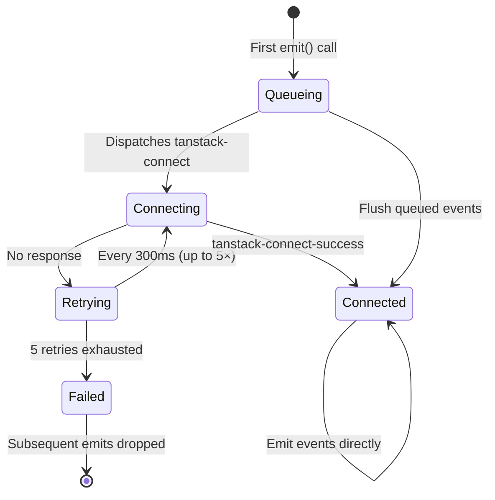

The event system is how plugins communicate with the devtools UI and with the application. It is built on `EventClient`, a type-safe event emitter/listener from `@tanstack/devtools-event-client`. It is completely framework-agnostic.

## EventClient Basics

Create a typed `EventClient` by extending the base class with your event map:

```ts
import { EventClient } from '@tanstack/devtools-event-client'

type MyEvents = {
  'state-update': { count: number }
  'action': { type: string }
}

class MyEventClient extends EventClient<MyEvents> {
  constructor() {
    super({ pluginId: 'my-plugin' })
  }
}

export const myEventClient = new MyEventClient()
```

The constructor accepts the following options:

| Option             | Type      | Default | Description                                          |
| ------------------ | --------- | ------- | ---------------------------------------------------- |
| `pluginId`         | `string`  | —       | Required. Identifies this plugin in the event system. |
| `debug`            | `boolean` | `false` | Enable debug logging to the console.                 |
| `enabled`          | `boolean` | `true`  | Whether the client connects to the bus at all.       |
| `reconnectEveryMs` | `number`  | `300`   | Interval (ms) between connection retry attempts.     |

## Event Maps and Type Safety

The generic `EventMap` type maps event names to payload types. Keys are event suffixes only — the `pluginId` is prepended automatically by `EventClient` when emitting and listening:

```ts
type MyEvents = {
  'state-update': { count: number }
  'action': { type: string }
}
```

TypeScript enforces correct event names and payload shapes at compile time. You get autocomplete on event names and type errors if the payload does not match the declared shape.

## Emitting Events

Call `eventClient.emit(eventSuffix, payload)` to dispatch an event. You pass only the **suffix** (the part after the colon). The `pluginId` is prepended automatically:

```ts
// If pluginId is 'my-plugin' and event map has 'state-update'
myEventClient.emit('state-update', { count: 42 })
// Dispatches event named 'my-plugin:state-update'
```

If the client is not yet connected to the bus, the event is queued and flushed once the connection succeeds (see [Connection Lifecycle](#connection-lifecycle) below).

## Listening to Events

There are three methods for subscribing to events. Each returns a cleanup function you call to unsubscribe.

### `on(eventSuffix, callback)`

Listen to a specific event from this plugin. Like `emit`, you pass only the suffix:

```ts
const cleanup = myEventClient.on('state-update', (event) => {
  console.log(event.payload.count) // typed as { count: number }
})

// Later: stop listening
cleanup()
```

The callback receives the full event object:

```ts
{
  type: 'my-plugin:state-update', // fully qualified event name
  payload: { count: number },     // typed payload
  pluginId: 'my-plugin'           // originating plugin
}
```

### `onAll(callback)`

Listen to **all** events from **all** plugins. Useful for logging, debugging, or building cross-plugin features:

```ts
const cleanup = myEventClient.onAll((event) => {
  console.log(event.type, event.payload)
})
```

### `onAllPluginEvents(callback)`

Listen to all events from **this** plugin only (filtered by `pluginId`):

```ts
const cleanup = myEventClient.onAllPluginEvents((event) => {
  // Only fires for events where event.pluginId === 'my-plugin'
  console.log(event.type, event.payload)
})
```

## Connection Lifecycle

The `EventClient` manages its connection to the event bus automatically:



1. **Queueing** — When you call `emit()` before the client is connected, events are queued in memory.
2. **Connection** — On the first `emit()`, the client dispatches a `tanstack-connect` event and starts a retry loop.
3. **Retries** — The client retries every `reconnectEveryMs` (default: 300ms) up to a maximum of 5 attempts.
4. **Flush** — Once a `tanstack-connect-success` event is received, all queued events are flushed to the bus in order.
5. **Failure** — If all 5 retries are exhausted without a successful connection, the client stops retrying. Subsequent `emit()` calls are silently dropped (they will not be queued).

### The `enabled` Option

When `enabled` is set to `false`, the EventClient is effectively inert — `emit()` is a no-op and `on()` returns a no-op cleanup function. This is useful for conditionally disabling devtools instrumentation (e.g., in production).

## Server Event Bus

When `connectToServerBus: true` is set in the component's `eventBusConfig` prop, the `ClientEventBus` connects to the `ServerEventBus` started by the Vite plugin (default port 4206). This enables server-side features like console piping and the plugin marketplace.

```tsx
<TanStackDevtools
  eventBusConfig={{
    connectToServerBus: true,
    debug: false,
    port: 4206, // default
  }}
/>
```

Without the Vite plugin running, the `EventClient` still works for same-page communication between your application code and the devtools panel. The server bus is only needed for features that bridge the browser and the dev server.

## Debugging

Set `debug: true` in the `EventClient` constructor or in `eventBusConfig` to enable verbose console logging. Debug logs are prefixed with `[tanstack-devtools:{pluginId}]` for plugin events and `[tanstack-devtools:client-bus]` for the client bus.

```ts
const myEventClient = new MyEventClient()
// In the constructor: super({ pluginId: 'my-plugin', debug: true })
```

Example output:

```
🌴 [tanstack-devtools:client-bus] Initializing client event bus
🌴 [tanstack-devtools:my-plugin] Registered event to bus my-plugin:state-update
🌴 [tanstack-devtools:my-plugin] Emitting event my-plugin:state-update
```

This is helpful when diagnosing issues with event delivery, connection timing, or verifying that your event map is wired up correctly.
