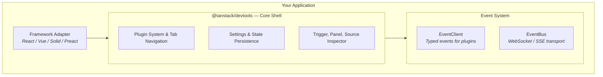

TanStack Devtools is a framework-agnostic devtool for managing and debugging *your devtools*.

We offer you all the tools you need to build and maintain your own devtools with ease.

We will continue to improve and expand the capabilities of TanStack Devtools, so you can focus on building great applications while we take care of the heavy lifting. We offer you an easy way
to add your own custom devtools and merge multiple instances of TanStack Devtools into a single cohesive experience.

> [!IMPORTANT]
> TanStack Devtools is currently in **alpha** and its API is subject to change.

## Origin

Have you ever wanted to build your own devtools? Then you start work on them, and you realize how complex and time-consuming it can be. First of all, you have to deal with the dreaded z-indexes!
Create the trigger, make sure you can move it, style the panel, handle the interactions, make sure
it's not getting in the way... The list keeps going on, and you're just trying to build your
next feature in half the time!

Well, that's where TanStack Devtools comes in. We provide a solid foundation for building your own devtools, so you can focus on what matters most: your application. We provide everything you need
out of the box and all you have to do is plug the simple custom devtool panel into your app!

## What's in the Box

TanStack Devtools is composed of several packages organized into layers. You only need to install the ones relevant to your use case.

### Framework Adapters

- `@tanstack/react-devtools`
- `@tanstack/vue-devtools`
- `@tanstack/solid-devtools`
- `@tanstack/preact-devtools`

Thin wrappers that integrate the devtools into your framework of choice. Pick the one that matches your app and you're good to go.

### Core

- `@tanstack/devtools` — The devtools shell UI built in Solid.js. Provides the plugin system, tab navigation, settings panel, and trigger button.

### Event System

- `@tanstack/devtools-event-client` — Type-safe event client for building custom plugins.
- `@tanstack/devtools-event-bus` — WebSocket/SSE transport layer connecting client and server.

### Build Tools

- `@tanstack/devtools-vite` — Vite plugin providing source inspection, console piping, enhanced logging, and production build stripping.

### Utilities

- `@tanstack/devtools-utils` — Plugin factory helpers for each framework.
- `@tanstack/devtools-ui` — Shared Solid.js UI component library.
- `@tanstack/devtools-client` — Internal typed event client for core devtools operations.

## Architecture

The diagram below shows how the layers connect at a high level:

Your application loads a **Framework Adapter**, which mounts the **Core Shell**. The shell manages the plugin lifecycle, renders tabs, and surfaces settings. Plugins communicate through the **Event System**, which provides typed events locally and can bridge to a server over WebSocket or SSE when needed.

## Key Features

- **Framework Agnostic**: Works with React, Vue, Solid, and Preact out of the box.
- **Plugin System & Marketplace**: Build, share, and install devtools plugins with a simple API.
- **Type-Safe Event System**: Communicate between plugins and the shell using fully typed events.
- **Source Inspector**: Click any element in your app to jump straight to its source code (go-to-source).
- **Console Piping**: Route devtools output to your browser console for a familiar debugging workflow.
- **Picture-in-Picture Mode**: Pop the devtools panel out into its own window so it never covers your app.
- **Customizable Hotkeys**: Rebind keyboard shortcuts to match your workflow.

## Next Steps

- [Quick Start](./quick-start) — Get running in 2 minutes
- [Architecture Overview](./architecture) — Understand how the pieces fit together
- [Building Custom Plugins](./building-custom-plugins) — Create your own devtools
