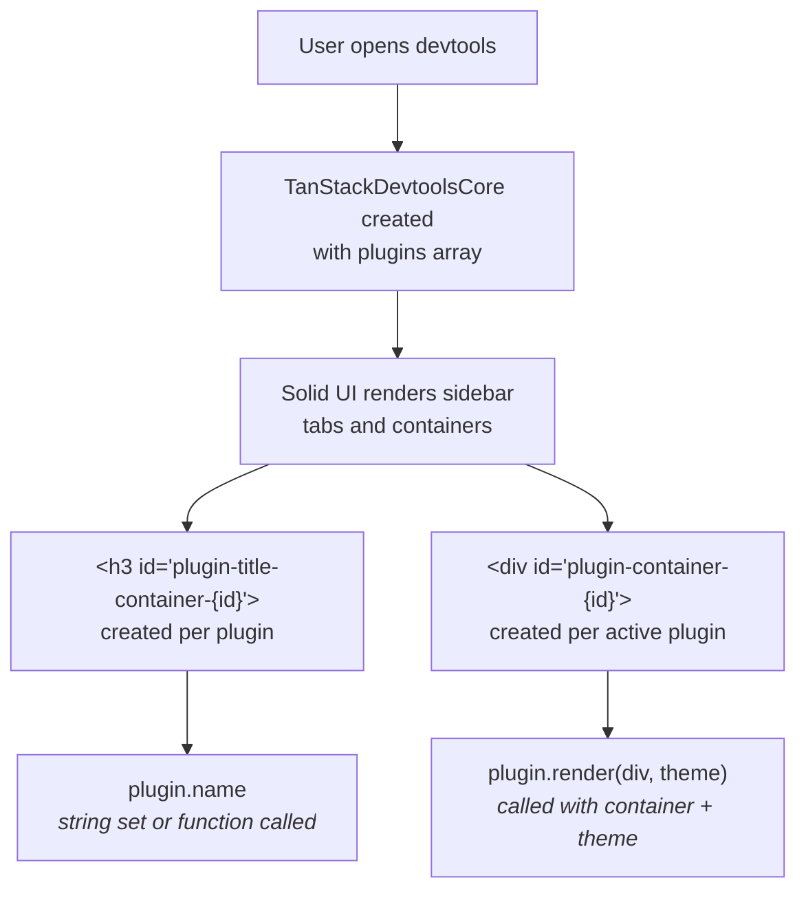
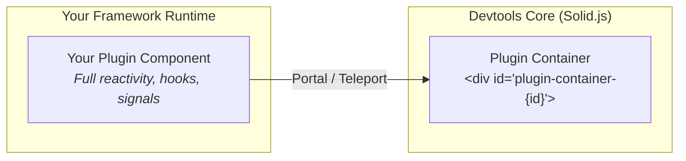

Every TanStack Devtools plugin follows a well-defined lifecycle: it is registered, mounted into a DOM container, rendered when activated, and cleaned up when the devtools unmount. This page walks through each stage in detail.

## Plugin Interface

All plugins implement the `TanStackDevtoolsPlugin` interface, which is the low-level contract between a plugin and the devtools core. Framework adapters (React, Vue, Solid, Preact) wrap this interface so you can work with familiar components, but under the hood every plugin is reduced to these fields:

```ts
interface TanStackDevtoolsPlugin {
  id?: string
  name: string | ((el: HTMLHeadingElement, theme: 'dark' | 'light') => void)
  render: (el: HTMLDivElement, theme: 'dark' | 'light') => void
  destroy?: (pluginId: string) => void
  defaultOpen?: boolean
}
```

### `id` (optional)

A unique identifier for the plugin. If you omit it, the core generates one from the `name` string (lowercased, spaces replaced with dashes, suffixed with the plugin's index). Providing an explicit `id` is useful when you need a stable identifier across page reloads - for example, to persist which plugins the user had open.

### `name` (required)

Displayed as the tab title in the sidebar. This can be:

- **A plain string** - rendered as text inside an `<h3>` element.
- **A function** - receives the heading element (`HTMLHeadingElement`) and the current theme (`'dark' | 'light'`). You can render anything into the heading, such as an icon next to the name or a fully custom title.

```ts
// Simple string name
{ name: 'My Plugin', render: (el) => { /* ... */ } }

// Custom title via function
{
  name: (el, theme) => {
    el.innerHTML = `<span style="color: ${theme === 'dark' ? '#fff' : '#000'}">My Plugin</span>`
  },
  render: (el) => { /* ... */ }
}
```

### `render` (required)

The main rendering function. It receives a `<div>` container element and the current theme. Your job is to render your plugin UI into this container using whatever approach you prefer - raw DOM manipulation, a framework portal, or anything else.

```ts
render: (el, theme) => {
  el.innerHTML = `<div class="${theme}">Hello from my plugin!</div>`
}
```

The `render` function is called:

1. When the plugin's tab is first activated (clicked or opened by default).
2. When the theme changes, so your UI can adapt.

### `destroy` (optional)

Called when the plugin is removed from the active set (e.g., the user deactivates the tab) or when the devtools unmount entirely. It receives the `pluginId` as its argument. Use this for cleanup - cancelling timers, closing WebSocket connections, removing event listeners, etc.

Most plugins don't need to implement `destroy` because framework adapters handle cleanup automatically.

### `defaultOpen` (optional)

When set to `true`, the plugin's panel will open automatically when the devtools first load and no user preferences exist in localStorage. At most 3 plugins can be open simultaneously, so if more than 3 specify `defaultOpen: true`, only the first 3 are opened.

This setting does **not** override saved user preferences. Once a user has interacted with the devtools and their active-plugin selection is persisted, `defaultOpen` has no effect.

If only a single plugin is registered, it opens automatically regardless of `defaultOpen`.

## Mount Sequence

Here is what happens when you provide plugins to the devtools:

1. **Initialization** - `TanStackDevtoolsCore` is instantiated with a `plugins` array. Each plugin is assigned an `id` if one is not already provided.

2. **DOM containers are created** - The core's Solid-based UI creates two DOM elements per plugin:
   - A content container: `<div id="plugin-container-{pluginId}">` where the plugin renders its UI.
   - A title container: `<h3 id="plugin-title-container-{pluginId}">` where the plugin's name is rendered.

3. **Title rendering** - For each plugin, the core checks if `name` is a string or function. If it's a string, the text is set directly on the heading element. If it's a function, the function is called with the heading element and current theme.

4. **Plugin activation** - When the user clicks a plugin's tab (or the plugin is auto-opened via `defaultOpen`), the plugin is added to the `activePlugins` list. The core then calls `plugin.render(container, theme)` with the content `<div>` and the current theme.

5. **Rendering** - The container is a regular `<div>` element. Your plugin can render anything into it - DOM nodes, a framework component tree via portals, a canvas, an iframe, etc.

6. **Theme changes** - When the user toggles the theme in settings, `render` is called again with the new theme value. Your plugin should update its appearance accordingly.



## Framework Adapter Pattern

You rarely interact with the raw `TanStackDevtoolsPlugin` interface directly. Instead, each framework adapter converts your familiar component model into the DOM-based plugin contract.

### React / Preact

The React adapter takes your JSX element and uses `createPortal` to render it into the plugin's container element:

```tsx
// What you write:
<TanStackDevtools
  plugins={[{
    name: 'My Plugin',
    render: <MyPluginComponent />,
  }]}
/>

// What happens internally:
// The adapter's render function calls:
//   createPortal(<MyPluginComponent />, containerElement)
```

Your React component runs in its normal React tree with full access to hooks, context, state management, etc. It just renders into a different DOM location via the portal.

### Solid

The Solid adapter uses Solid's `<Portal>` component to mount your JSX into the container:

```tsx
// What you write:
<TanStackDevtools
  plugins={[{
    name: 'My Plugin',
    render: <MyPluginComponent />,
  }]}
/>

// What happens internally:
// The adapter wraps your component in:
//   <Portal mount={containerElement}>{yourComponent}</Portal>
```

Since the devtools core is itself built in Solid, this is the most native integration. Your component runs inside the same Solid reactive system as the devtools shell.

### Vue

The Vue adapter uses `<Teleport>` to render your Vue component into the container:

```vue
<!-- What you write: -->
<TanStackDevtools
  :plugins="[{
    name: 'My Plugin',
    component: MyPluginComponent,
    props: { someProp: 'value' },
  }]"
/>

<!-- What happens internally: -->
<!-- The adapter renders: -->
<Teleport :to="'#plugin-container-' + pluginId">
  <component :is="plugin.component" v-bind="plugin.props" :theme="theme" />
</Teleport>
```

Your Vue component receives the `theme` as a prop along with any other props you pass. It runs within the Vue app's reactivity system with full access to composition API, inject/provide, etc.

### The Key Insight



Regardless of framework, your plugin component runs in its **normal framework context** with full reactivity, hooks, signals, lifecycle methods, and dependency injection. It just renders into a different DOM location via portals or teleports. This means:

- React plugins can use `useState`, `useEffect`, `useContext`, and any React library.
- Solid plugins can use signals, stores, `createEffect`, and the full Solid API.
- Vue plugins can use `ref`, `computed`, `watch`, `inject`, and any Vue composable.

The framework adapter handles all the wiring between your component and the devtools container.

## Plugin State

The devtools persist the active/visible plugin selection in `localStorage` under the key `tanstack_devtools_state`. This means that when a user opens specific plugin tabs, their selection survives page reloads.

Key behaviors:

- **Maximum 3 visible plugins** - At most 3 plugin panels can be displayed simultaneously. Activating a 4th plugin deactivates the earliest one.
- **`defaultOpen` vs. saved state** - If `defaultOpen: true` is set on a plugin and no saved state exists in localStorage, the plugin opens on first load. Once the user changes the selection, their preference takes precedence.
- **Single-plugin auto-open** - If only one plugin is registered, it opens automatically regardless of `defaultOpen` or saved state.
- **Stale plugin cleanup** - When the devtools load, any plugin IDs in the saved state that no longer match a registered plugin are automatically removed.

## Cleanup

When `TanStackDevtoolsCore.unmount()` is called - either explicitly or because the framework component unmounts - the following happens:

1. The Solid reactive system disposes of the entire devtools component tree.
2. For each active plugin that provides a `destroy` function, `destroy(pluginId)` is called.
3. All DOM containers created by the core are removed.

Framework adapters handle their own cleanup automatically:

- **React** unmounts the portal, which triggers the normal React cleanup cycle (`useEffect` cleanup functions, etc.).
- **Vue** destroys the Teleport, which runs `onUnmounted` hooks in your component.
- **Solid** disposes of the Portal's reactive scope, running any `onCleanup` callbacks.

You typically do **not** need to implement `destroy` unless your plugin has manual subscriptions, timers, WebSocket connections, or other resources that aren't tied to your framework's lifecycle. If all your cleanup is handled by framework hooks (like `useEffect` cleanup in React or `onCleanup` in Solid), the adapter takes care of it for you.
