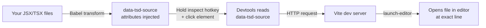

The source inspector lets you click any element in your app to open its source file in your editor. When activated, the devtools overlay highlights elements as you hover over them and shows their source file location. Click to open the file at the exact line.

## Requirements

Two things are needed for the source inspector to work:

- The `@tanstack/devtools-vite` plugin must be installed and running (dev server only)
- Source injection must be enabled: `injectSource.enabled: true` (this is the default)

The feature only works in development. In production builds, source attributes are not injected.

## How It Works



The Vite plugin uses Babel to parse your JSX/TSX files during development. It adds a `data-tsd-source="filepath:line:column"` attribute to every JSX element. When you activate the source inspector and click an element, the devtools reads this attribute and sends a request to the Vite dev server. The server then launches your editor at the specified file and line using `launch-editor`.

## Activating the Inspector

There are two ways to activate the source inspector:

- **Hotkey**: Hold Shift+Alt+Ctrl (or Shift+Alt+Meta on Mac) — this is the default `inspectHotkey`. While held, the inspector overlay appears.
- **Settings panel**: The inspect hotkey can be customized in the devtools Settings tab.

The hotkey can also be configured programmatically:

```ts
<TanStackDevtools
  config={{
    inspectHotkey: ['Shift', 'Alt', 'CtrlOrMeta'],
  }}
/>
```

## Ignoring Files and Components

Not all elements need source attributes. Use the `ignore` config to exclude files or components:

```ts
import { devtools } from '@tanstack/devtools-vite'

export default {
  plugins: [
    devtools({
      injectSource: {
        enabled: true,
        ignore: {
          files: ['node_modules', /.*\.test\.(js|ts|jsx|tsx)$/],
          components: ['InternalComponent', /.*Provider$/],
        },
      },
    }),
  ],
}
```

Both `files` and `components` accept arrays of strings (exact match) or RegExp patterns.

## Editor Configuration

Most popular editors work out of the box via the `launch-editor` package. Supported editors include VS Code, WebStorm, Sublime Text, Atom, and more ([full list](https://github.com/yyx990803/launch-editor?tab=readme-ov-file#supported-editors)).

For unsupported editors, use the `editor` config:

```ts
devtools({
  editor: {
    name: 'My Editor',
    open: async (path, lineNumber, columnNumber) => {
      const { exec } = await import('node:child_process')
      exec(`myeditor --goto "${path}:${lineNumber}:${columnNumber}"`)
    },
  },
})
```
