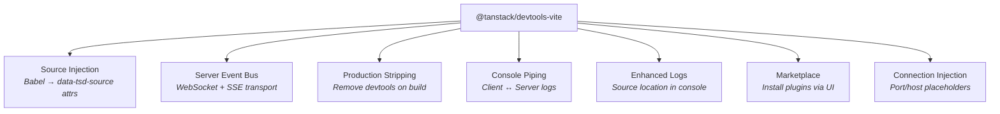

The Vite Plugin for TanStack Devtools provides a seamless integration for using the devtools in your Vite-powered applications. With this plugin, you get complementary features on top of the
existing features built into the devtools like better console logs, server event bus, and enhanced debugging capabilities.

## Installation

To add the devtools vite plugin you need to install it as a development dependency:

```sh
npm install -D @tanstack/devtools-vite
```

Then add it as the *FIRST* plugin in your Vite config:

```ts
import { devtools } from '@tanstack/devtools-vite'

export default {
  plugins: [
    devtools(),
    // ... rest of your plugins here
  ],
}
```

And you're done!

## Configuration

You can configure the devtools plugin by passing options to the `devtools` function:

```ts
import { devtools } from '@tanstack/devtools-vite'

export default {
  plugins: [
    devtools({
      // options here
    }),
    // ... rest of your plugins here
  ],
}
```

### eventBusConfig

  Configuration for the event bus that the devtools use to communicate with the client

```ts
import { devtools } from '@tanstack/devtools-vite'

export default {
  plugins: [
    devtools({
      eventBusConfig: {
        // port to run the event bus on
        port: 1234,
        // console log debug logs or not
        debug: false,
        // enables the server event bus (defaults to true), you can disable it if you're running devtools in something like storybook or vitest
        enabled: true
      },
    }),
    // ... rest of your plugins here
  ],
}

```

### editor

> [!IMPORTANT] 
> `editor` is used as an escape hatch to implement your own go-to-source functionality if your system/editor does not work OOTB. We use `launch-editor` under the hood which supports a lot of editors but not all. If your editor is not supported you can implement your own version here. Here is the list of supported editors: https://github.com/yyx990803/launch-editor?tab=readme-ov-file#supported-editors

The open in editor configuration which has two fields, `name` and `open`,
`name` is the name of your editor, and `open` is a function that opens the editor with the given file and line number. You can implement your version for your editor as follows:

 ```ts
import { devtools } from '@tanstack/devtools-vite'

export default {
  plugins: [
    devtools({
      editor: {
        name: 'VSCode',
        open: async (path, lineNumber, columnNumber) => {
          const { exec } = await import('node:child_process')
          exec(
            // or windsurf/cursor/webstorm
            `code -g "${(path).replaceAll('$', '\\$')}${lineNumber ? `:${lineNumber}` : ''}${columnNumber ? `:${columnNumber}` : ''}"`,
          )
        },
      },
    }),
    // ... rest of your plugins here
  ],
}

```

### enhancedLogs

  Configuration for enhanced logging. Defaults to enabled.

```ts
import { devtools } from '@tanstack/devtools-vite'

export default {
  plugins: [
    devtools({
      enhancedLogs: {
        enabled: true
      }
    }),
    // ... rest of your plugins here
  ],
}
```

### removeDevtoolsOnBuild

Whether to remove devtools from the production build. Defaults to true.

```ts
import { devtools } from '@tanstack/devtools-vite'

export default {
  plugins: [
    devtools({
      removeDevtoolsOnBuild: true
    }),
    // ... rest of your plugins here
  ],
}
```

### logging
  Whether to log information to the console. Defaults to true.

```ts
import { devtools } from '@tanstack/devtools-vite'

export default {
  plugins: [
    devtools({
      logging: true
    }),
    // ... rest of your plugins here
  ],
}
```

### injectSource

Configuration for source injection. Defaults to enabled.


```ts
import { devtools } from '@tanstack/devtools-vite'

export default {
  plugins: [
    devtools({
      injectSource: {
        enabled: true,
        ignore: {
          // files to ignore source injection for
          files: ['node_modules', /.*\.test\.(js|ts|jsx|tsx)$/],
          // components to ignore source injection for
          components: ['YourComponent', /.*Lazy$/],
        },
      }
    }),
    // ... rest of your plugins here
  ],
}
```

### consolePiping

Configuration for bidirectional console piping between client and server. When enabled, console logs from the client will appear in your terminal, and server logs will appear in the browser console. Defaults to enabled.

```ts
import { devtools } from '@tanstack/devtools-vite'

export default {
  plugins: [
    devtools({
      consolePiping: {
        // Whether to enable console piping (defaults to true)
        enabled: true,
        // Which console methods to pipe (defaults to all)
        levels: ['log', 'warn', 'error', 'info', 'debug'],
      }
    }),
    // ... rest of your plugins here
  ],
}
```

## Features

The Vite plugin is composed of several sub-plugins, each handling a specific concern:



### Go to Source

The "Go to Source" feature lets you click on any element in your browser and open its source file in your editor at the exact line where it's defined. It works by injecting `data-tsd-source` attributes into your components via a Babel transformation during development. These attributes encode the file path and line number of each element.

To use it, activate the source inspector by holding the inspect hotkey (default: Shift+Alt+Ctrl/Meta). An overlay will highlight elements under your cursor and display their source location. Clicking on a highlighted element opens the corresponding file in your editor at the exact line, powered by `launch-editor` under the hood.

For a complete guide on configuration and usage, see the [Source Inspector](./source-inspector) docs.

### Console Piping

When enabled (default), `console.log()` and other console methods in the browser are piped to your terminal, and server-side console output appears in the browser console. This is particularly useful when debugging SSR or API routes — you see all logs in one place without switching between terminal and browser. Configure which log levels are piped via `consolePiping.levels`.

### Enhanced Logs

Console logs are enhanced with clickable source locations. In the browser console, each log shows the file and line number where it originated. Click to open the source file in your editor. Enable/disable via the `enhancedLogs` config option.

### Production Build Stripping

By default (`removeDevtoolsOnBuild: true`), the Vite plugin replaces all devtools imports with empty modules in production builds. This includes:
- `@tanstack/react-devtools`
- `@tanstack/vue-devtools`
- `@tanstack/solid-devtools`
- `@tanstack/preact-devtools`
- `@tanstack/devtools`

This ensures zero devtools code reaches production. Set `removeDevtoolsOnBuild: false` to keep devtools in production (see [Production](./production) docs).

### Plugin Marketplace

The Vite plugin enables the in-devtools plugin marketplace. When you browse available plugins in the devtools Settings tab and click "Install", the Vite plugin handles the npm/pnpm/yarn installation and automatically injects the plugin import into your devtools setup file. This only works during development with the Vite dev server running.
